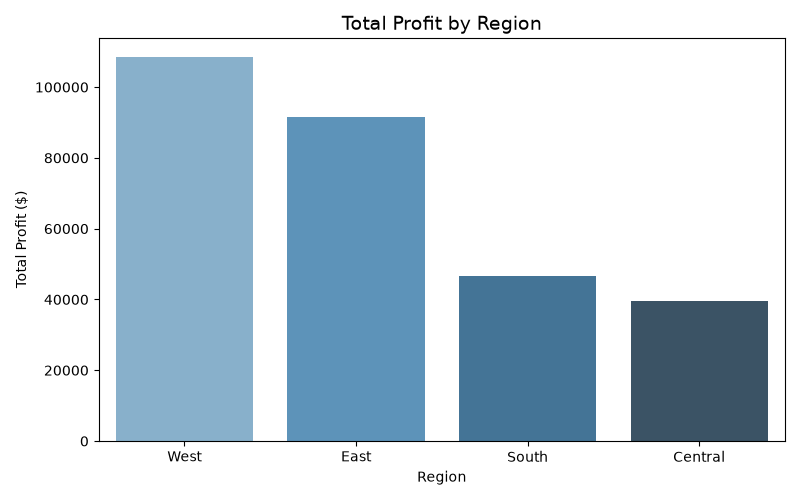
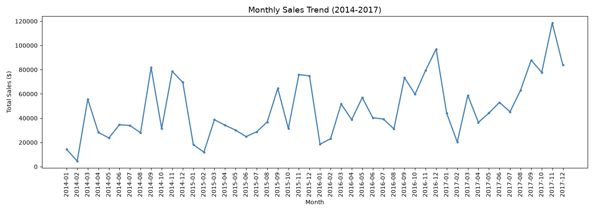
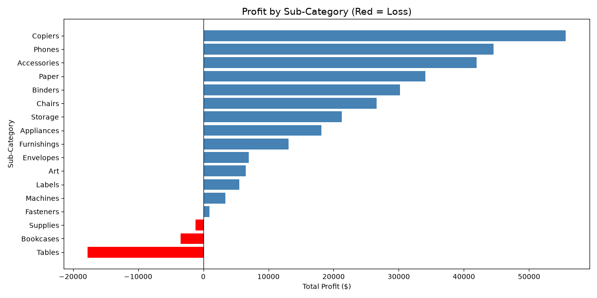
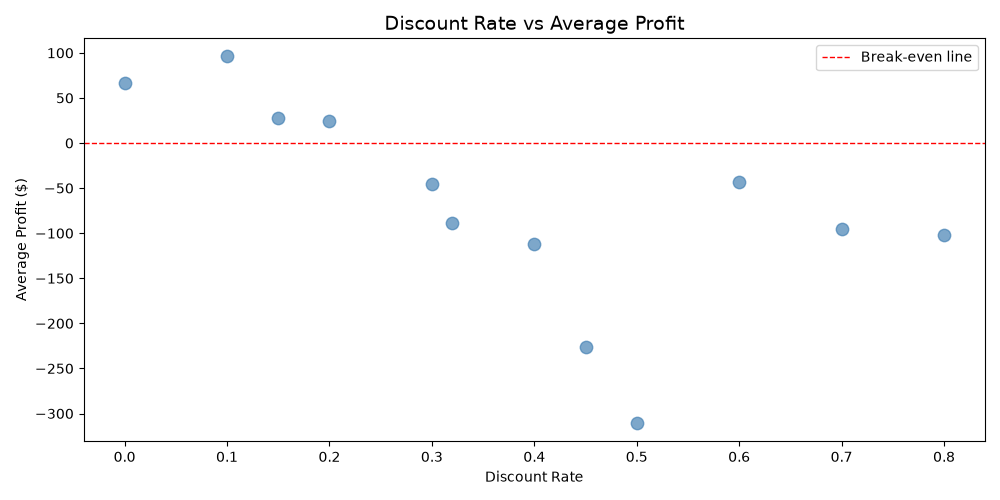

# Superstore Sales Analysis
**Tools Used:** Excel | MySQL | Python (pandas, matplotlib, seaborn)  
**Dataset:** Sample Superstore — 9,994 orders (2014–2017)

## Objective
Analyse sales and profit data from a US retail superstore to identify 
underperforming products, regions, and the impact of discounting on profitability.

## Key Findings

| # | Finding |
|---|---------|
| 1 | West region leads in total profit ($106K); Central has the weakest margin (8%) |
| 2 | Tables sub-category loses $17,725 despite $206K in sales |
| 3 | Discounts above 20% consistently result in average losses |
| 4 | Home Office segment has the highest profit margin (14%) |
| 5 | Sales peak every September, November and December across all years |
| 6 | New York and Michigan are the most profitable states by margin |

## Charts

### Profit by Region

### Monthly Sales Trend

### Profit by Sub-Category

### Discount Rate vs Profit

## Files
| File | Description |
|------|-------------|
| superstore_analysis.py | Python script for analysis and chart generation |
| chart1–4 .png | Output charts |

## Tools & Skills Demonstrated
- **Excel:** Data cleaning, duplicate removal, Pivot Tables, charts
- **MySQL:** 7 queries — aggregations, grouping, filtering, date functions
- **Python:** pandas for analysis, matplotlib & seaborn for visualization
